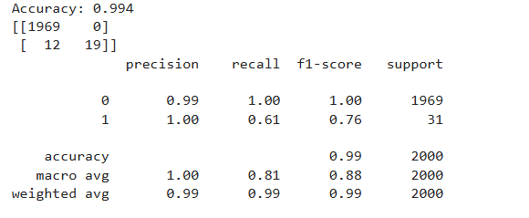
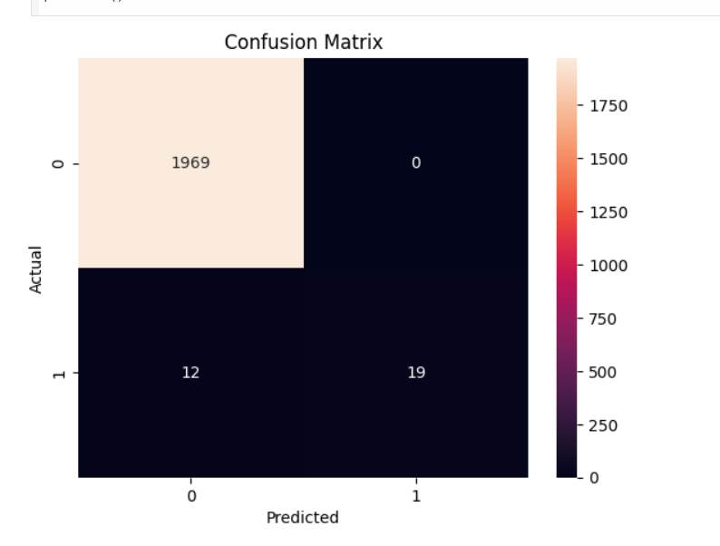

# 💳 Credit Card Fraud Detection

## 📌 Project Overview

This project is a **Machine Learning-based system** designed to detect fraudulent credit card transactions.
It analyzes transaction patterns and classifies whether a transaction is **fraudulent or genuine**.

---

## 🚀 Features

* Fraud detection using Machine Learning
* Data preprocessing and cleaning
* Model training and prediction
* Performance evaluation using metrics
* Visualization using confusion matrix

---

## 🛠️ Tech Stack

* Python 🐍
* Pandas & NumPy
* Scikit-learn
* Matplotlib & Seaborn
* Jupyter Notebook / Google Colab

---

## 📂 Dataset Information

The dataset contains **10,000 transactions** with features such as:

* Transaction ID
* Amount
* Transaction Hour
* Merchant Category
* Foreign Transaction
* Location Mismatch
* Device Trust Score
* Velocity (last 24 hours)
* Cardholder Age
* Target: `is_fraud`

---

## ⚙️ Machine Learning Model

* Algorithm Used: **Naive Bayes** *(update if different)*
* Train-Test Split applied
* Model trained and tested on dataset
* Predictions made using `predict()`

---

## 📊 Model Evaluation

* **Accuracy: XX%** *(replace with your value)*
* Confusion Matrix
* Classification Report

---

## 📈 Model Performance

The model achieved an accuracy of **XX%**, showing its effectiveness in identifying fraudulent transactions while minimizing false predictions.

---

## 📸 Output Screenshots

### 🔹 Results



### 🔹 Confusion Matrix



---

## ▶️ How to Run the Project

1. Clone the repository:

   ```bash
   git clone https://github.com/Nayonika28/credit-card-fraud-detection.git
   ```

2. Open the notebook in Jupyter Notebook or Google Colab

3. Install required libraries:

   ```bash
   pip install pandas numpy matplotlib seaborn scikit-learn
   ```

4. Run all cells to see results

---

## 🎯 Project Objective

To build a system that helps in:

* Detecting fraudulent transactions
* Improving financial security
* Reducing fraud risk in digital payments

---

## 📈 Future Enhancements

* Implement advanced models (Random Forest, XGBoost)
* Deploy as a web application using Flask
* Real-time fraud detection system
* Integration with banking systems

---

## 👩‍💻 Author

**Nayonika**
📍Thiruvallur, India

---

## ⭐ Acknowledgment

This project was developed as part of an internship to gain practical knowledge in Machine Learning and real-world problem solving.
